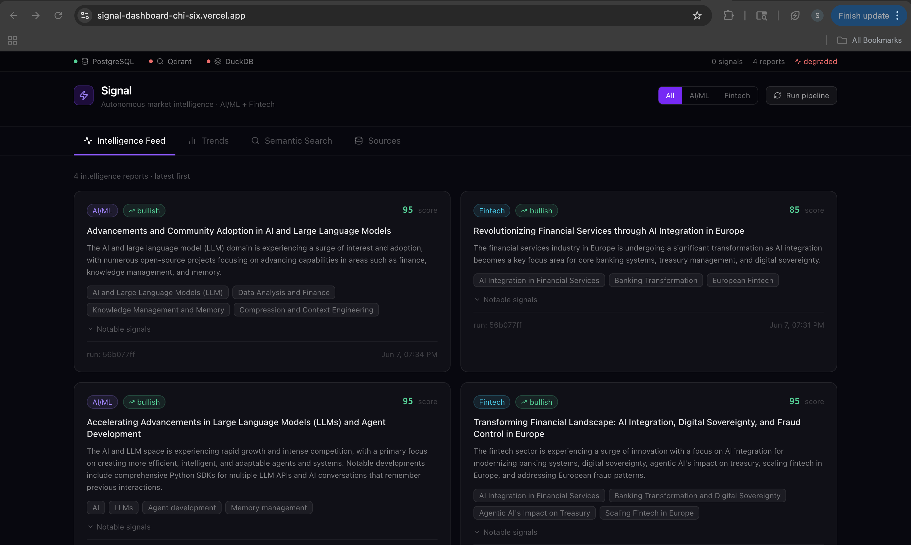
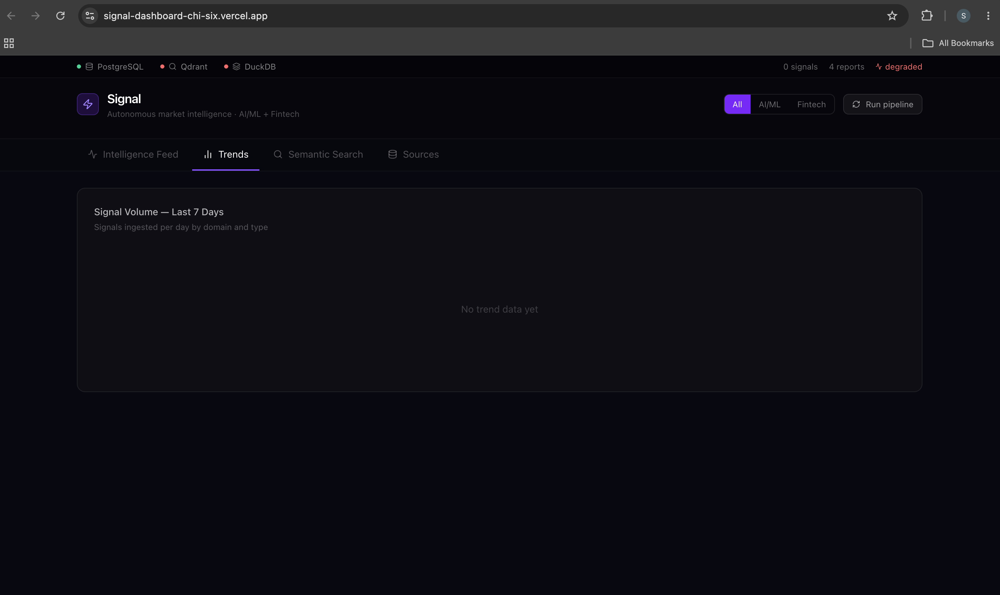
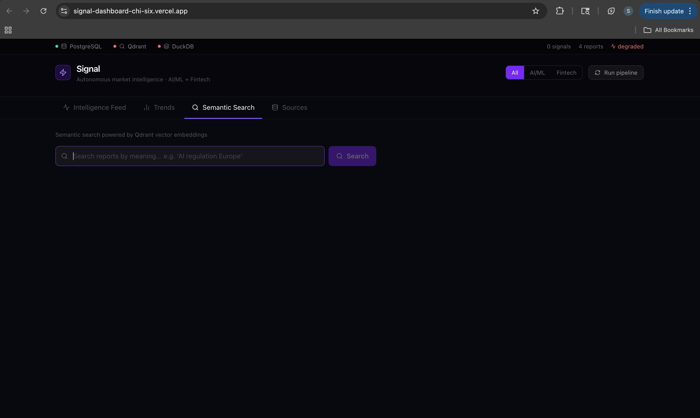
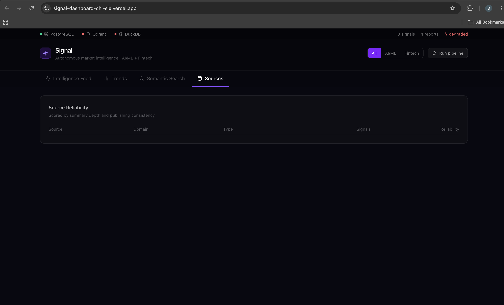
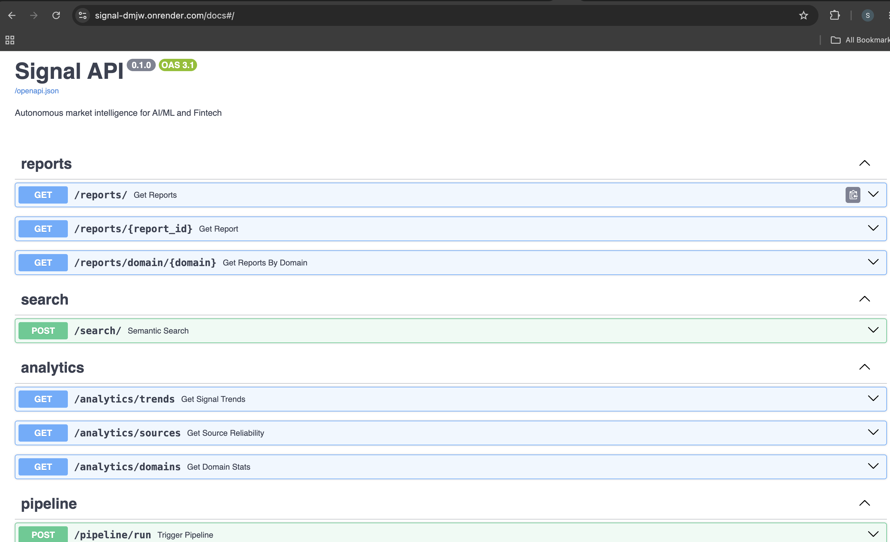
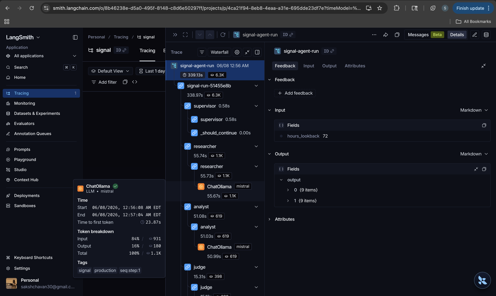

# Signal 📡

> Autonomous market intelligence agent for AI/ML and Fintech — built end-to-end with a modern 2026 stack.

Signal continuously monitors the AI/ML and Fintech landscape, ingests signals from 17 sources every 6 hours, reasons over them using a 4-node LangGraph agent, and produces scored intelligence reports — fully autonomously, with no human in the loop.

**[Live Dashboard](https://signal-dashboard-chi-six.vercel.app) · [API Docs](https://signal-dmjw.onrender.com/docs) · [GitHub](https://github.com/Sakshi3027/signal)**

---

## What it does

Every 6 hours, Signal wakes up on Modal's serverless cloud, pulls fresh signals from RSS feeds, GitHub trending repos, and arXiv research papers, then passes them through a LangGraph agent that reasons, writes, and self-evaluates intelligence reports. Every run is traced in LangSmith. Every report is stored in PostgreSQL and embedded in Qdrant for semantic search.

No prompts. No human triggers. Just autonomous intelligence.

---

## Live Demo

### Intelligence Feed

*The main dashboard showing AI/ML and Fintech intelligence reports generated by the agent. Each card shows the domain, sentiment (bullish/bearish/neutral), quality score out of 100 given by the LLM-as-judge node, key themes extracted from 25+ signals, and the run ID that produced it.*

### Signal Trends

*Signal volume over time broken down by domain and source type — news, repositories, and research papers. Powered by dbt models running on DuckDB.*

### Semantic Search

*Vector search across all intelligence reports using 384-dimensional sentence-transformer embeddings stored in Qdrant Cloud. Search by meaning, not keywords — "AI regulation Europe" returns reports about digital sovereignty and compliance even if those exact words don't appear.*

### Source Reliability

*Source reliability scores computed by dbt models — scoring each of the 17 ingestion sources by summary depth and publishing consistency. Used by the Supervisor node to prioritize which signals to analyze.*

### API — Swagger Docs

*Auto-generated OpenAPI documentation for all 9 endpoints: reports, semantic search, analytics (trends, sources, domains), pipeline trigger, and health check. Built with FastAPI, deployed on Render.*

### LangSmith Observability

*Every agent run is fully traced in LangSmith. Each node — Supervisor, Researcher, Analyst, Judge — appears as a separate span with its own latency, token usage, input/output, and tags. The Judge node scores reports 0–1 and re-routes to the Analyst if the score falls below 0.7.*

---

## Architecture
┌─────────────────────────────────────────────────────────┐
│                 Ingestion (Modal cron, every 6h)         │
│  RSS Feeds · GitHub API · arXiv → dlt → DuckDB          │
└─────────────────────┬───────────────────────────────────┘
│ 500+ signals
┌─────────────────────▼───────────────────────────────────┐
│              LangGraph Agent (4 nodes)                   │
│                                                          │
│  Supervisor → Researcher → Analyst → Judge               │
│                               ↑_________↓               │
│                         (retry if score < 0.7)           │
└──────┬──────────────────────────────────────────────────┘
│ reports + embeddings
┌──────▼──────────────────────────────────────────────────┐
│                    Storage Layer                         │
│  PostgreSQL (reports) · Qdrant (vectors) · DuckDB (raw) │
│  dbt models: signal_trends · source_reliability         │
└──────┬──────────────────────────────────────────────────┘
│
┌──────▼──────────────────────────────────────────────────┐
│              FastAPI (9 endpoints) + Next.js dashboard   │
│  Reports · Semantic Search · Analytics · Pipeline        │
└─────────────────────────────────────────────────────────┘

---

## Stack

| Layer | Tools |
|---|---|
| **Ingestion** | `dlt` · `DuckDB` · RSS · GitHub API · arXiv API |
| **Agent** | `LangGraph` · `Pydantic AI` · `Mistral` (local via Ollama) |
| **Storage** | `PostgreSQL` · `Qdrant Cloud` · `DuckDB` |
| **Transformation** | `dbt` — 3 marts: signal_trends, source_reliability, domain_summary |
| **API** | `FastAPI` · 9 endpoints · auto Swagger docs |
| **Dashboard** | `Next.js` · `Recharts` · `Tailwind CSS` |
| **Observability** | `LangSmith` — full agent run tracing, token tracking |
| **Deployment** | `Modal` (cron) · `Render` (API) · `Vercel` (dashboard) · `Qdrant Cloud` |
| **Package management** | `uv` workspace monorepo |

---

## Agent Design

The agent is a stateful LangGraph graph with 4 nodes and conditional edges:

**Supervisor** — reads DuckDB stats, batches signals by domain, decides what to investigate

**Researcher** — takes a batch of 25 signals per domain, calls Mistral locally to extract structured context: themes, significant signals, sentiment

**Analyst** — takes the extracted context and writes a structured intelligence report: title, summary, key themes, notable signals, sentiment

**Judge** — scores the report 0–1 on specificity, completeness, and coherence. If score < 0.7, routes back to the Analyst with feedback. If score ≥ 0.7 or retries exhausted, accepts the report.

Every node is decorated with `@traceable` — every run, input, output, and token count appears in LangSmith automatically.

---

## Data Sources (17 total)

**AI/ML:** HuggingFace Blog · LangChain Blog · Simon Willison · DeepLearning.AI · OpenAI News · GitHub (LLM, LangChain, ML, LangGraph repos) · arXiv (cs.LG, cs.AI, cs.CL)

**Fintech:** TechCrunch Fintech · Finextra · PYMNTS · GitHub (fintech, trading repos) · arXiv (q-fin.CP, q-fin.TR, q-fin.RM)

---

## Running locally

```bash
# Clone and install
git clone https://github.com/Sakshi3027/signal
cd signal
uv sync --all-packages

# Start Ollama (local LLM — free, no API cost)
ollama pull mistral
ollama serve

# Start storage
docker compose up -d

# Copy env
cp .env.example .env  # fill in GITHUB_TOKEN and LANGCHAIN_API_KEY

# Run ingestion
uv run python -m ingestion.pipeline

# Run agent
uv run python -m agent.runner

# Start API
uv run uvicorn api.main:app --reload --port 8000

# Start dashboard
cd dashboard && npm install && npm run dev
```

---

## Deployment

| Service | Platform | Purpose |
|---|---|---|
| Ingestion cron | Modal | Runs every 6 hours, free tier |
| FastAPI backend | Render | 9 REST endpoints |
| Next.js dashboard | Vercel | Live UI |
| Vector store | Qdrant Cloud | Semantic search |
| Relational DB | Render PostgreSQL | Reports storage |

---

## Project structure

signal/
├── packages/
│   ├── ingestion/          # dlt pipelines: RSS, GitHub, arXiv
│   ├── agent/              # LangGraph graph: Supervisor→Researcher→Analyst→Judge
│   └── storage/            # PostgreSQL, Qdrant, dbt models
├── api/                    # FastAPI: 9 endpoints + Swagger
├── dashboard/              # Next.js: feed, trends, search, sources
├── dbt/                    # dbt models + tests + schema docs
├── modal_ingestion.py      # Modal serverless cron deployment
└── run_pipeline.py         # Local full pipeline runner

---

## What this demonstrates

**For Data Scientist roles:** Feature extraction from unstructured signals, LLM-as-judge evaluation design, quality scoring, domain analysis

**For Data Analyst roles:** dbt models with tests and documentation, analytical marts, source reliability scoring, trend analysis

**For ML Engineer roles:** Production pipeline orchestration, LangGraph stateful graphs, checkpoint-based debugging, conditional retry routing, serverless deployment

**For AI Engineer roles:** Multi-agent architecture, tool calling, vector search, LangSmith observability, end-to-end agent evaluation

---

## Built with

`Python 3.12` · `uv` · `dlt 1.27` · `LangGraph 1.2` · `Pydantic AI 1.1` · `FastAPI 0.136` · `Next.js 16` · `dbt-duckdb 1.10` · `Qdrant 1.18` · `LangSmith` · `Modal 1.4` · `Ollama` · `Mistral 7B`